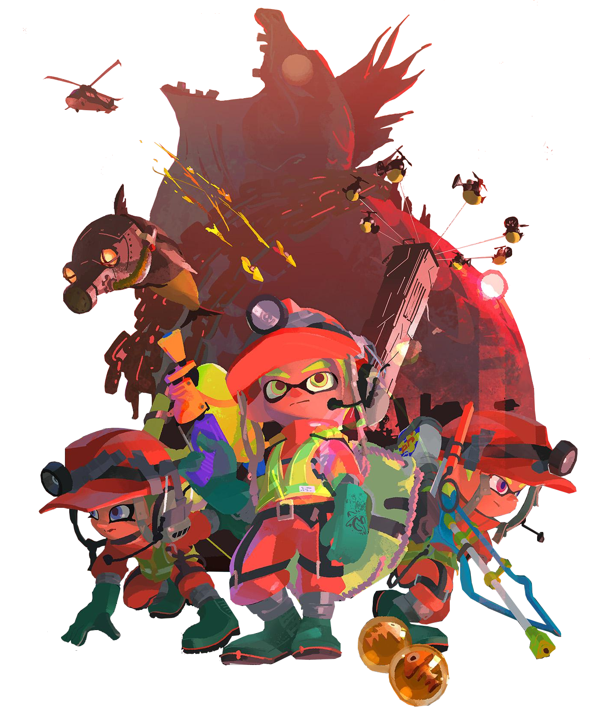

  

<!-- Social icons section -->

  
  &#8287;&#8287;&#8287;&#8287;&#8287;
  
  &#8287;&#8287;&#8287;&#8287;&#8287;
  
  &#8287;&#8287;&#8287;&#8287;&#8287;
  
  &#8287;&#8287;&#8287;&#8287;&#8287;
  
  &#8287;&#8287;&#8287;&#8287;&#8287;
  

## 👋 Hi there, Good day!

#### **Here are facts about me to get you started**
- 🔭 Currently immersed in an exciting new project - stay tuned for updates!
- 💬 Open to collaboration on any backend projects and always eager to learn something new.
- 😍 Ask me about *Java, Kotlin* ... 😅[profile-summary-for-github](https://profile-summary-for-github.com/user/hoangtien2k3qx1)
- 🤝 Let's connect! Find me on
  -  `gmail`: hoangtien2k3qx1@gmail.com
  -  `website`: [*hoangtien2k3qx1.github.io*](https://hoangtien2k3qx1.github.io/)
- ⚡ Don't forget to follow and star, support my projects! ❤️💕✌️

  
<h5> 😅 Details about me</h5>

  

  

  <h3>🔥 Streak Stats</h3>

  <!-- GitHub Readme Streak Stats - https://github.com/DenverCoder1/github-readme-streak-stats -->
  

    
    
🔥 Get streak stats for your profile at <a href="hoangtien2k3qx1.github.io">hoangtien2k3qx1.github.io</a>

  

  <h3>💻💬 GitHub Profile Stats</h3>

  

    
    
    
    
    
    
    
    
    
    
    
    
    
    
    
    
    
    
    
    
    
    
    
    

  
  
  

  <b>Note:</b> Top languages is only a metric of the languages my public code consists of and doesn't reflect experience or skill level.

  

  <h3>⚡ Recent GitHub Activity</h3>

 
  

  

  

##

    
    
    
    
    
    
    
    
    
    
    
    
    
       

 

