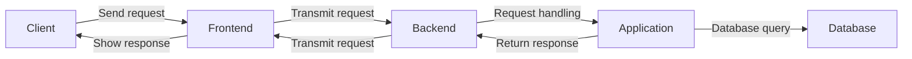

  

 

<!-- Social icons section -->

  
  &#8287;&#8287;&#8287;&#8287;&#8287;
  
  &#8287;&#8287;&#8287;&#8287;&#8287;
  
  &#8287;&#8287;&#8287;&#8287;&#8287;
  
  &#8287;&#8287;&#8287;&#8287;&#8287;
  
  &#8287;&#8287;&#8287;&#8287;&#8287;
  

<h3 align="center"> </h3>

- 🔭 I’m currently a student.
- 💬 I'm a: **Java/Kotlin - Backend Developer**
- 📫 How to reach me: *hoangtien2k3qx1@gmail.com*
- ⚡ This my website: [*hoangtien2k3qx1.github.io*](https://hoangtien2k3qx1.github.io/)
- 🔥 Profile at github: [*https://profile-github/hoangtien2k3qx1*](https://profile-summary-for-github.com/user/hoangtien2k3qx1)

    
    
    
    
    
    
    
    
    
    
    
    
    
    
    
    
    
    
    
    
    
    
    
    

	

  
   

