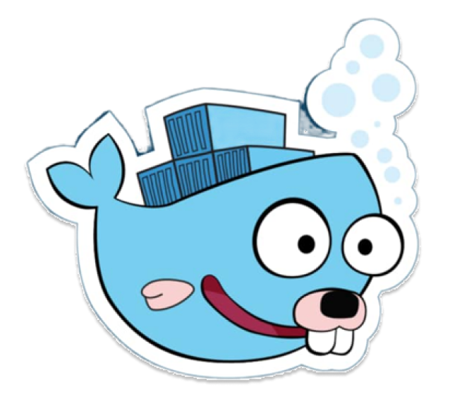

<!-- Title The Full Name -->

  

<!-- Social icons section -->

  
  &#8287;&#8287;&#8287;&#8287;&#8287;
  
  &#8287;&#8287;&#8287;&#8287;&#8287;
  
  &#8287;&#8287;&#8287;&#8287;&#8287;
  
  &#8287;&#8287;&#8287;&#8287;&#8287;
  
  &#8287;&#8287;&#8287;&#8287;&#8287;
  

<!-- Information myself -->
<h2>👋 Hi there, Good Day</h2>

  

  

I am passionate about technology, especially in backend system development. I enjoy learning, exploring new knowledge, 
and actively contributing to open-source projects for the community. In addition, I regularly share knowledge on my TikTok channel 🇻🇳[ctdl.gt](https://www.tiktok.com/@ctdl.gt)

<picture>
  <source media="(prefers-color-scheme: dark)" srcset="https://raw.githubusercontent.com/hoangtien2k3/hoangtien2k3/output/pacman-contribution-graph-dark.svg">
  <source media="(prefers-color-scheme: light)" srcset="https://raw.githubusercontent.com/hoangtien2k3/hoangtien2k3/output/pacman-contribution-graph.svg">
  
</picture>

  

<h2>📚 Language and Tools</h2>

   
   
   
   
  
  
  
  
  
  
  
  
  
  
    
   
   

<!-- More Information Details Myself -->

  More -> the portrait of a backend dev wannabe who commits at 3 AM🔥
  

 

</a>

<picture>
  <source media="(prefers-color-scheme: dark)" srcset="https://raw.githubusercontent.com/hoangtien2k3/hoangtien2k3/output/pacman-contribution-graph-dark.svg">
  <source media="(prefers-color-scheme: light)" srcset="https://raw.githubusercontent.com/hoangtien2k3/hoangtien2k3/output/pacman-contribution-graph.svg">
  
</picture>

 <h3 align="left"> 📚 Languages and Tools </h3>

  
  
  
  
  
  
  
  
  
  
  
  
  

                                      

<h3>🔥 Streak Stats</h3>

  <!-- GitHub Readme Streak Stats - https://github.com/DenverCoder1/github-readme-streak-stats -->
  

    
    
🔥 Get streak stats for your profile at <a href="hoangtien2k3.github.io">hoangtien2k3.github.io</a>

  

<h3>💻💬 GitHub Profile Stats</h3>

  

    
    
    
    
    
    
    
    
    
    
    
    
    
    
    
    
    
    
    
    
    
    
    
    

<b>Note:</b> Top languages is only a metric of the languages my public code consists of and doesn't reflect experience
or skill level.

<h3>⚡ Recent GitHub Activity</h3>

 
  

  

<a href="https://github.com/hoangtien2k3">

  
